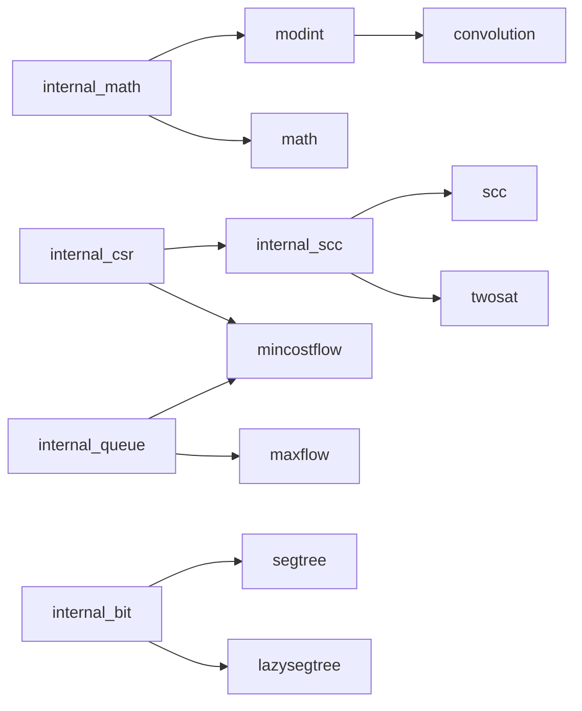

# AtCoder Library 对照与可抄写设计

依据 [issue #3](https://github.com/gsh20040816/CPCtemplate/issues/3)，固定参考版本 [`864245a00b00`](https://github.com/atcoder/ac-library/tree/864245a00b00dd008d1abfdc239618fdb7d139da/atcoder)。许可为 CC0-1.0。本次检查覆盖 `atcoder/all` 中的 12 个公开模块及 6 个内部支持头文件；逐文件摘要见 [acl-coverage.json](acl-coverage.json)。

这是接口、分类与缺项审查，不把 ACL 的正确性或验证记录直接转移给本库。

## 分类和覆盖

| ACL 模块 | 分类 | 当前状态 | 本库对应 |
|---|---|---|---|
| [dsu](https://github.com/atcoder/ac-library/blob/864245a00b00dd008d1abfdc239618fdb7d139da/atcoder/dsu.hpp) | 数据结构 | 功能已有，按用户约定保留 | [data_structure.hpp](../src/compact/data_structure.hpp) |
| [fenwicktree](https://github.com/atcoder/ac-library/blob/864245a00b00dd008d1abfdc239618fdb7d139da/atcoder/fenwicktree.hpp) | 数据结构 | 基础功能已有，组合约束不同 | [data_structure.hpp](../src/compact/data_structure.hpp)、[number_theory.hpp](../src/compact/number_theory.hpp) |
| [segtree](https://github.com/atcoder/ac-library/blob/864245a00b00dd008d1abfdc239618fdb7d139da/atcoder/segtree.hpp) | 数据结构 | 已实现，本地验证 | [segtree.hpp](../src/compact/segtree.hpp) |
| [lazysegtree](https://github.com/atcoder/ac-library/blob/864245a00b00dd008d1abfdc239618fdb7d139da/atcoder/lazysegtree.hpp) | 数据结构 | 部分覆盖 | [affine_segment_tree.hpp](../src/compact/affine_segment_tree.hpp) |
| [math](https://github.com/atcoder/ac-library/blob/864245a00b00dd008d1abfdc239618fdb7d139da/atcoder/math.hpp) | 数学 | 核心功能已有，范围需适配 | [number_theory.hpp](../src/compact/number_theory.hpp) |
| [modint](https://github.com/atcoder/ac-library/blob/864245a00b00dd008d1abfdc239618fdb7d139da/atcoder/modint.hpp) | 数学 | 部分覆盖 | [number_theory.hpp](../src/compact/number_theory.hpp) |
| [convolution](https://github.com/atcoder/ac-library/blob/864245a00b00dd008d1abfdc239618fdb7d139da/atcoder/convolution.hpp) | 数学 | 模卷积已有，精确整数卷积缺失 | [ntt_convolution.hpp](../src/compact/ntt_convolution.hpp)、[polynomial.hpp](../src/compact/polynomial.hpp) |
| [maxflow](https://github.com/atcoder/ac-library/blob/864245a00b00dd008d1abfdc239618fdb7d139da/atcoder/maxflow.hpp) | 图论 | 主算法已有，部分编辑接口缺失 | [flow.hpp](../src/compact/flow.hpp) |
| [mincostflow](https://github.com/atcoder/ac-library/blob/864245a00b00dd008d1abfdc239618fdb7d139da/atcoder/mincostflow.hpp) | 图论 | 主算法已有，费用曲线缺失 | [flow.hpp](../src/compact/flow.hpp) |
| [scc](https://github.com/atcoder/ac-library/blob/864245a00b00dd008d1abfdc239618fdb7d139da/atcoder/scc.hpp) | 图论 | 核心功能已有 | [tarjan.hpp](../src/compact/tarjan.hpp)、[graph.hpp](../src/compact/graph.hpp) |
| [twosat](https://github.com/atcoder/ac-library/blob/864245a00b00dd008d1abfdc239618fdb7d139da/atcoder/twosat.hpp) | 图论 | 核心功能已有 | [graph.hpp](../src/compact/graph.hpp) |
| [string](https://github.com/atcoder/ac-library/blob/864245a00b00dd008d1abfdc239618fdb7d139da/atcoder/string.hpp) | 字符串 | 功能已有，复杂度与表示有差异 | [string.hpp](../src/compact/string.hpp)、[suffix_lcp.hpp](../src/compact/suffix_lcp.hpp) |

## 结构配合

以下箭头表示基础模块被上层使用。内部支持层用于理解依赖，不自动作为独立算法章节收录。

适合赛时借鉴的做法：

1. **把运算约定与树结构分开。** 通用线段树需要 op/e；懒标记还需要 mapping/composition/id。实现可以按题目删减，但先写明结合律、单位元与组合方向。
2. **组合顺序要用非交换例子校验。** 先做 `g(x)=2x+1`，再做 `f(x)=3x+4`，应得到 `6x+7`；反过来是 `6x+9`。仿射标签 `composition(f,g)` 必须对应前者。
3. **区间运算保持左右顺序。** 对矩阵乘法、字符串拼接等非交换 op，左右累积器不能交换；只有加法测试不能覆盖这个性质。
4. **把坐标与编号作为接口契约。** ACL 普遍使用 0-based/半开区间，本库有 1-based/闭区间。适配空区间时不能直接传入 `r-1` 而触发原接口断言。SCC 的编号方向、2-SAT 的真假编码与赋值不等式也必须整体校验。
5. **稳定原边编号有利于输出方案。** 本库 Dinic 返回正向残量边 ID，ACL 返回逻辑原边编号；二者不是可随意互换的同一种整数。修改边容量/流量必须同时维护正反残量。
6. **静态图可借鉴 CSR。** `vector` 扁平存储和起止偏移可减少小分配，适合 SCC 等静态建图；不直接套到需要增删边的接口。
7. **只带必要支持代码。** 了解 internal_bit、internal_math、internal_queue 等作用，优先使用选定 C++ 标准提供的简短设施；不把兼容旧编译器的全部工程分支搬入可抄写正文。
8. **保持用户指定版本。** #2 中的 dsu 保留指定合并方向与 bool 返回值，不用 ACL 的按大小合并/返回根接口覆盖它。

## 逐模块差异

### dsu

ACL 返回合并后的根并采用按大小合并；本库按用户 #2 回复保留 bool merge、指定根连接方向和 fa/sz。双方均能给出 groups，不能用 ACL 版本覆盖用户指定实现。

### fenwicktree

ACL 为 0-based 点更新、半开区间和；本库为 1-based，另有仅适用于有序频数的 kth。Fenwick<ModInt> 的 add/sum/query 已补齐复合赋值，并通过独立整数余数参考测试；kth 不适用于模数和。

组合验证见下文；其他自定义类型仍需满足加法及减法契约。

### segtree

已实现 [segtree.hpp](../src/compact/segtree.hpp)：任意结合运算与双侧单位元、点修改、半开区间查询和双向边界搜索。左右累积保留非交换顺序。独立字符串拼接与单调子串判定扫描、空树、非二次幂大小、50 万叶子均通过普通和 ASan/UBSan；函数复合完整驱动使用逐函数代入参考。

Predecessor Problem 402089 已通过构造、set/get 和双向边界搜索（22 点，383 ms、184.02 MiB）。函数复合 402090 也已 AC（16 点，247 ms、26.82 MiB），覆盖构造/set/prod；all 与空区间仍只作本地验证。已有本地通过不代表在线验证完成，懒标记树仍为单独缺项。

### lazysegtree

已补充 [lazy_segtree.hpp](../src/compact/lazy_segtree.hpp)，采用递归下传与搜索，运算、单位元和作用由模板参数传入。composition(f,g) 为先 g 后 f。点设置会清除叶子旧标记，查询会下传但不改变逻辑序列；不要求标记类型提供相等比较。

仿射向量参考、字符串赋值的非交换顺序、独立左右边界扫描及 50 万叶子全区间待下传标记通过普通与 ASan/UBSan。区间仿射完整驱动也通过独立模数向量参考；在线提交及边界搜索线上题仍待完成。

### math

power、inverse、crt、floor_sum 已存在。ACL crt 批量返回 pair，本库原位逐条合并；ACL floor_sum 的 n,m 范围到 2^32 且溢出取模2^64，本库说明范围较小并返回精确 int128，不能直接宣称契约完全相同。

后续项：逐项核对 floor_sum 的边界范围及溢出语义。

### modint

当前 ModInt 支持固定模数算术，inv 按素数模数约定。ACL 静态合数模逆采用 inv_gcd，另有按 id 区分的动态模数类型；小类型及 unsigned 内部存储与溢出界不能只抄一半。

后续项：运行时模数类型；静态合数模数的单位元求逆契约。

### convolution

已有参数化素数模 NTT 卷积。ACL convolution_ll 返回有符号64位精确系数，采用三模重构并限制结果范围；单模卷积或把结果随意取模不能替代。

后续项：convolution_ll 等精确有符号整数卷积封装。

### maxflow

Dinic 已有加边、最大流、used 和 cut；ACL 以稳定逻辑边号公开 get_edge/edges/change_edge。当前没有按容量与流量成对修改正反残量的受约束接口。

后续项：change_edge 及对应残量不变量验证。

### mincostflow

当前 flow 返回最终流量和 int128 费用，初始负费用边也有单独契约。ACL 要求初始 cost 非负并提供 slope；两者不能混写成本域和重入条件。

后续项：最小费用随流量变化的 slope 折点输出。

### scc

ACL 通过 internal_scc 共享实现并输出拓扑顺序分组。本库有逆拓扑编号的 Tarjan 与正向编号的 Kosaraju，已对 QOJ906 适配；编号方向必须保留在组合说明中。

### twosat

本库 TwoSAT 已复用 SCC。ACL 的变量编号、真假节点编码与比较方向应整体核对；不能仅替换 SCC 类型或照抄答案不等式。

### string

后缀数组、LCP 和 Z 已有。ACL 用 SA-IS，本库用倍增；ACL LCP 长 n-1，本库长度 n 且首项0；两者 Z[0] 均取 n。SA-IS 是性能/复杂度上的未实现替代，不是后缀数组功能全缺。

后续项：SA-IS 线性后缀数组实现尚无。

## 已修复的组合缺口

初次审查在 cc3b1c8 复现 `Fenwick<ModInt<998244353>>` 因缺少 `operator+=` 无法编译；[原编译诊断](../verification/acl-fenwick-modint-probe.txt) 保留为历史证据。

当前已添加 `+=`、`-=`、`*=`、`/=`，沿用二元运算，返回自身引用。[复现程序](../verification/probes/fenwick_modint.cpp) 已改为成功回归检查。[组合测试](../tests/modint_composition.cpp) 使用整数余数数组验证 Fenwick 的 add/sum/query，以扩展欧几里得验证除法，覆盖模数 2、998244353、2147483647、自赋值、链式运算、负输入和 signed64 边界。普通与 ASan/UBSan 日志在 verification/modint-composition-*.txt。

这些新增运算符只有本地验证，未借用历史 OJ AC。静态素数求逆契约未变，动态模数及合数单位元求逆仍是缺项；模数和不适合 Fenwick 的 kth 顺序统计。

## 后续实施顺序

与 #1 的模板题清单对齐后，优先处理可复现的组合缺口和通用线段树边界搜索，再补 slope、精确整数卷积与动态模数。SA-IS 属于性能/复杂度替代，不把已验证的倍增后缀数组标为缺失。每项仍须独立题目、边界和性能验证。
