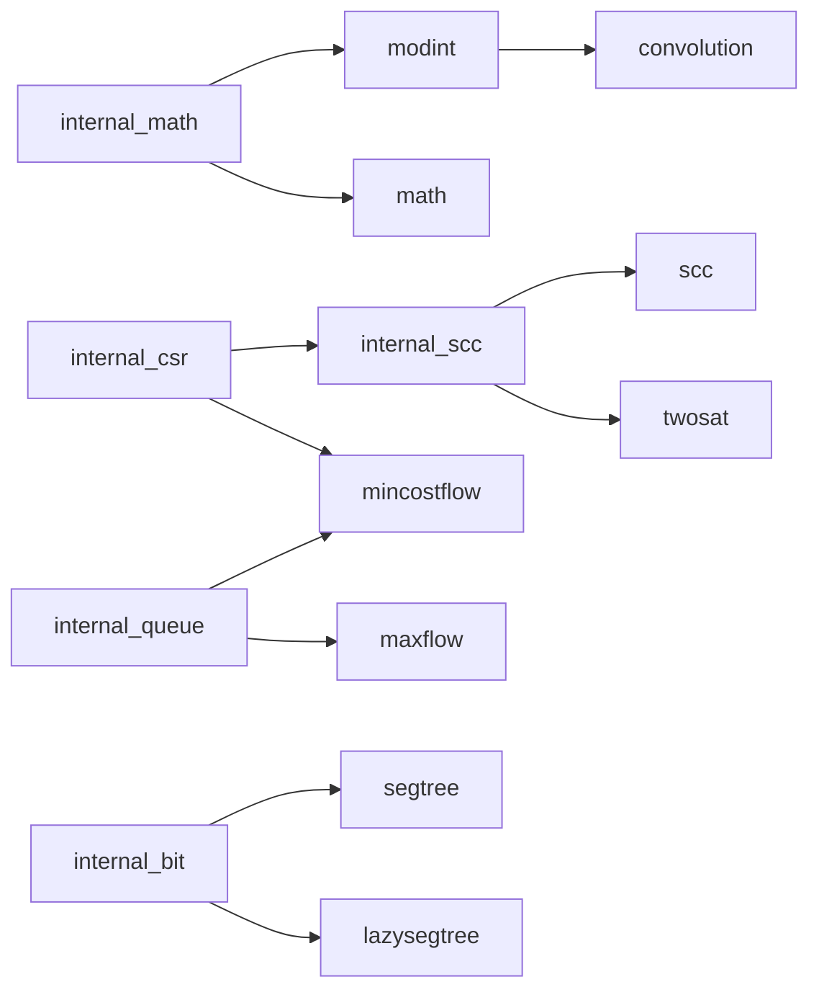

# AtCoder Library 对照与可抄写设计

依据 [issue #3](https://github.com/gsh20040816/CPCtemplate/issues/3)，固定参考版本 [`864245a00b00`](https://github.com/atcoder/ac-library/tree/864245a00b00dd008d1abfdc239618fdb7d139da/atcoder)。许可为 CC0-1.0。本次检查覆盖 `atcoder/all` 中的 12 个公开模块及 6 个内部支持头文件；逐文件摘要见 [acl-coverage.json](acl-coverage.json)。

这是接口、分类与缺项审查，不把 ACL 的正确性或验证记录直接转移给本库。

2026-10-02 以本库 `8b09b35` 核对当前组件路径与既有证据边界。此次仅修正文档和元数据，不重新运行算法、提交 OJ 或刷新排名。JSON 的 `local_snapshot_commit` / `local_source_sha256` 保留最初审查快照，明确是历史摘要；`historical_composition_probe` 保存最初失败记录，不能当作现版本失败。当前组合回归的已有证据另列。

## 分类和覆盖

| ACL 模块 | 分类 | 当前状态 | 本库对应 |
|---|---|---|---|
| [dsu](https://github.com/atcoder/ac-library/blob/864245a00b00dd008d1abfdc239618fdb7d139da/atcoder/dsu.hpp) | 数据结构 | 功能已有，按用户约定保留 | [data_structure.hpp](../src/compact/data_structure.hpp) |
| [fenwicktree](https://github.com/atcoder/ac-library/blob/864245a00b00dd008d1abfdc239618fdb7d139da/atcoder/fenwicktree.hpp) | 数据结构 | 基础功能已有，组合约束不同 | [data_structure.hpp](../src/compact/data_structure.hpp)、[number_theory.hpp](../src/compact/number_theory.hpp) |
| [segtree](https://github.com/atcoder/ac-library/blob/864245a00b00dd008d1abfdc239618fdb7d139da/atcoder/segtree.hpp) | 数据结构 | 已实现，函数复合与边界搜索有历史线上记录 | [segtree.hpp](../src/compact/segtree.hpp) |
| [lazysegtree](https://github.com/atcoder/ac-library/blob/864245a00b00dd008d1abfdc239618fdb7d139da/atcoder/lazysegtree.hpp) | 数据结构 | 通用递归实现已完成，本地验证通过 | [lazy_segtree.hpp](../src/compact/lazy_segtree.hpp) |
| [math](https://github.com/atcoder/ac-library/blob/864245a00b00dd008d1abfdc239618fdb7d139da/atcoder/math.hpp) | 数学 | 核心功能已有，范围需适配 | [mod64.hpp](../src/compact/mod64.hpp)、[extended_gcd.hpp](../src/compact/extended_gcd.hpp)、[mod_inverse.hpp](../src/compact/mod_inverse.hpp)、[crt_merge.hpp](../src/compact/crt_merge.hpp)、[floor_sum.hpp](../src/compact/floor_sum.hpp) |
| [modint](https://github.com/atcoder/ac-library/blob/864245a00b00dd008d1abfdc239618fdb7d139da/atcoder/modint.hpp) | 数学 | 静态与动态实现已有，支持合数单位元求逆 | [number_theory.hpp](../src/compact/number_theory.hpp)、[dynamic_modint.hpp](../src/compact/dynamic_modint.hpp) |
| [convolution](https://github.com/atcoder/ac-library/blob/864245a00b00dd008d1abfdc239618fdb7d139da/atcoder/convolution.hpp) | 数学 | 模卷积与精确整数卷积已有，本地验证 | [ntt_convolution.hpp](../src/compact/ntt_convolution.hpp)、[convolution_i64.hpp](../src/compact/convolution_i64.hpp) |
| [maxflow](https://github.com/atcoder/ac-library/blob/864245a00b00dd008d1abfdc239618fdb7d139da/atcoder/maxflow.hpp) | 图论 | 边状态接口已补，本地验证 | [flow.hpp](../src/compact/flow.hpp) |
| [mincostflow](https://github.com/atcoder/ac-library/blob/864245a00b00dd008d1abfdc239618fdb7d139da/atcoder/mincostflow.hpp) | 图论 | 费用曲线已补，本地验证 | [flow.hpp](../src/compact/flow.hpp) |
| [scc](https://github.com/atcoder/ac-library/blob/864245a00b00dd008d1abfdc239618fdb7d139da/atcoder/scc.hpp) | 图论 | 核心功能已有 | [tarjan.hpp](../src/compact/tarjan.hpp)、[graph.hpp](../src/compact/graph.hpp) |
| [twosat](https://github.com/atcoder/ac-library/blob/864245a00b00dd008d1abfdc239618fdb7d139da/atcoder/twosat.hpp) | 图论 | 核心功能已有 | [graph.hpp](../src/compact/graph.hpp) |
| [string](https://github.com/atcoder/ac-library/blob/864245a00b00dd008d1abfdc239618fdb7d139da/atcoder/string.hpp) | 字符串 | SA-IS与倍增并列，LCP表示不同 | [string.hpp](../src/compact/string.hpp)、[suffix_lcp.hpp](../src/compact/suffix_lcp.hpp)、[sais.hpp](../src/compact/sais.hpp) |

## 结构配合

以下箭头表示基础模块被上层使用。内部支持层用于理解依赖，不自动作为独立算法章节收录。

```mermaid
graph LR
  modint --> convolution
  internal_math --> modint
  internal_math --> math
  internal_scc --> scc
  internal_scc --> twosat
  internal_csr --> internal_scc
  internal_csr --> mincostflow
  internal_queue --> maxflow
  internal_queue --> mincostflow
  internal_bit --> segtree
  internal_bit --> lazysegtree
```

适合赛时借鉴的做法：

1. **把运算约定与树结构分开。** 通用线段树需要 op/e；懒标记还需要 mapping/composition/id。实现可以按题目删减，但先写明结合律、单位元与组合方向。
2. **组合顺序要用非交换例子校验。** 先做 `g(x)=2x+1`，再做 `f(x)=3x+4`，应得到 `6x+7`；反过来是 `6x+9`。仿射标签 `composition(f,g)` 必须对应前者。
3. **区间运算保持左右顺序。** 对矩阵乘法、字符串拼接等非交换 op，左右累积器不能交换；只有加法测试不能覆盖这个性质。
4. **把坐标与编号作为接口契约。** ACL 普遍使用 0-based/半开区间，本库有 1-based/闭区间。适配空区间时不能直接传入 `r-1` 而触发原接口断言。SCC 的编号方向、2-SAT 的真假编码与赋值不等式也必须整体校验。
5. **稳定原边编号有利于输出方案。** 本库 Dinic 返回正向残量边 ID，ACL 返回逻辑原边编号；二者不是可随意互换的同一种整数。修改边容量/流量必须同时维护正反残量。
6. **静态图可借鉴 CSR。** `vector` 扁平存储和起止偏移可减少小分配，适合 SCC 等静态建图；不直接套到需要增删边的接口。
7. **只带必要支持代码。** 了解 internal_bit、internal_math、internal_queue 等作用，优先使用选定 C++ 标准提供的简短设施；不把兼容旧编译器的全部工程分支搬入可抄写正文。
8. **保持用户指定版本。** #2 中的 dsu 保留指定合并方向与 bool 返回值，不用 ACL 的按大小合并/返回根接口覆盖它。

## 逐模块差异

### dsu

ACL 返回合并后的根并采用按大小合并；本库按用户 #2 回复保留 bool merge、指定根连接方向和 fa/sz。双方均能给出 groups，不能用 ACL 版本覆盖用户指定实现。

### fenwicktree

ACL 为 0-based 点更新、半开区间和；本库为 1-based，另有仅适用于有序频数的 kth。Fenwick<ModInt> 的 add/sum/query 已补齐复合赋值，并通过独立整数余数参考测试；kth 不适用于模数和。

组合验证见下文；其他自定义类型仍需满足加法及减法契约。

### segtree

已实现 [segtree.hpp](../src/compact/segtree.hpp)：任意结合运算与双侧单位元、点修改、半开区间查询和双向边界搜索。左右累积保留非交换顺序。独立字符串拼接与单调子串判定扫描、空树、非二次幂大小、50 万叶子均通过普通和 ASan/UBSan；函数复合完整驱动使用逐函数代入参考。

历史 Predecessor Problem 402089 已通过构造、set/get 和双向边界搜索（22 点，383 ms、184.02 MiB）。函数复合 402090 也已 AC（16 点，247 ms、26.82 MiB），覆盖构造/set/prod；all 与空区间仍只作本地验证。历史 AC 按提交时源码和实际调用接口解释，不等于当前全部接口重新线上验证。懒标记树的线上证据仍需单独补齐。

### lazysegtree

已补充 [lazy_segtree.hpp](../src/compact/lazy_segtree.hpp)，采用递归下传与搜索，运算、单位元和作用由模板参数传入。composition(f,g) 为先 g 后 f。点设置会清除叶子旧标记，查询会下传但不改变逻辑序列；不要求标记类型提供相等比较。

仿射向量参考、字符串赋值的非交换顺序、独立左右边界扫描及 50 万叶子全区间待下传标记通过普通与 ASan/UBSan。区间仿射完整驱动也通过独立模数向量参考；在线提交及边界搜索线上题仍待完成。

### math

当前正文直接使用 [Mod64](../src/compact/mod64.hpp)、[extended_gcd](../src/compact/extended_gcd.hpp)、[mod_inverse](../src/compact/mod_inverse.hpp)、[crt_merge](../src/compact/crt_merge.hpp) 和 [floor_sum](../src/compact/floor_sum.hpp)；NumberTheory 仅为未重复打印的兼容入口。

ACL crt 批量返回 pair；本库逐式原位合并，不可解返回 false，周期超过 signed64 时抛异常。mod_inverse 对不可逆元素返回 −1，不能照搬 ACL 的调用前提与失败处理。

floor_sum 的[现有文档契约](mathematics.tex)为 `0<=n<=10^9`、`1<=m<=10^9`，a/b 支持 signed64，返回精确 int128。ACL 的 n/m 范围小于 2^32，并在结果溢出时取模 2^64；本库未承诺该完整范围和溢出语义。既有[独立测试](../tests/floor_sum.cpp)与官方本地数据不自动扩张范围，也不替代线上证据。

### modint

当前 ModInt 支持1..INT_MAX固定模数，包括合数。try_inv对单位元返回optional值、不可逆返回nullopt；模1返回零代表。inv及除法要求分母可逆，关闭断言后不承诺拒绝非法调用。内部短欧几里得使用long long，不新增外部打印依赖；契约、界与验证见[STATIC-MODINT-UNITS.md](STATIC-MODINT-UNITS.md)。ACL静态合数模逆采用inv_gcd；不能只抄其unsigned内部算术而丢失溢出界。

动态 [mint<tag>](../src/compact/dynamic_modint.hpp) 已实现并有普通及 ASan/UBSan 本地证据，支持 1..INT_MAX 运行时模数、合数单位元 try_inv 和 tag 隔离。修改同 tag 模数后须重建旧对象与缓存。P5431 与 batch_units 的[完整打印用法198](INVERSE-USAGES.md)已有本地验证，但动态版线上 AC 仍待补，不能转移原整数版 P5431 的历史 AC。静态ModInt仍位于number_theory.hpp。本批扩展静态单位元求逆，未扩大Binomial、NTT、高斯或FPS的独立素数条件；新实现的线上证据仍待补。

### convolution

已有参数化素数模 NTT 卷积。ACL convolution_ll 返回有符号64位精确系数，采用三模重构并限制结果范围；单模卷积或把结果随意取模不能替代。

已补齐 convolution_i64 三模精确重构，契约与证明见 [INTEGER-CONVOLUTION.md](INTEGER-CONVOLUTION.md)。cpp_int 参考、signed64 极值及百万次数驱动的普通与 ASan/UBSan 测试通过，线上 AC 和性能排名待验证。

### maxflow

Dinic 已有加边、最大流、used 和 cut；ACL 以稳定逻辑边号公开 get_edge/edges/change_edge。现已补 get_edge/change_edge，修改正反残量对并维护 initial，明确全局守恒由调用方负责。

割枚举与流证书、增容续算、整图清流缩容、自环/环流和 int64 上界已有本地普通及 ASan/UBSan 证据。新方法尚未在线验证；既有最大流 AC 不验证它们。本库未提供 ACL 同名 edges() 批量接口，可保存 add 返回的原边 ID 后逐项调用 get_edge；不声称 API 完全相同。

### mincostflow

当前 flow 返回最终流量和 int128 费用，初始负费用边也有单独契约。ACL 要求初始 cost 非负并提供 slope；两者不能混写成本域和重入条件。

slope 折点输出已本地实现，支持负费用且无负环、限流与同源汇续流；相同边际费用合并。全量边流枚举验证每个整数流量的费用，普通及 ASan/UBSan 通过。线上验证仍待完成。

### scc

ACL 通过 internal_scc 共享实现并输出拓扑顺序分组。本库有逆拓扑编号的 Tarjan 与正向编号的 Kosaraju，已对 QOJ906 适配；编号方向必须保留在组合说明中。

### twosat

本库 TwoSAT 已复用 SCC。ACL 的变量编号、真假节点编码与比较方向应整体核对；不能仅替换 SCC 类型或照抄答案不等式。

### string

后缀数组、LCP和Z已有；新增独立SAIS诱导排序，与倍增SuffixArray并列。整数已知字母表为O(n+alphabet)，离散化另计。ACL LCP长n-1，本库长n且首项0；两者Z[0]取n。旧倍增线上记录不迁移给新实现，SuffixLCP仍只直接接受SuffixArray。

接口、诱导排序与LMS命名证明见 [SAIS.md](SAIS.md)。固定ACL来源与旧本地快照保持历史含义，本轮实现另行验证。

后续项：SA-IS新实现的独立线上AC与受控性能比较尚未完成；SuffixLCP不直接接受SAIS类型。

## 已修复的组合缺口

初次审查在 cc3b1c8 复现 `Fenwick<ModInt<998244353>>` 因缺少 `operator+=` 无法编译；[原编译诊断](../verification/acl-fenwick-modint-probe.txt) 保留为历史证据。

当前已添加 `+=`、`-=`、`*=`、`/=`，沿用二元运算，返回自身引用。[复现程序](../verification/probes/fenwick_modint.cpp) 已改为成功回归检查。[组合测试](../tests/modint_composition.cpp) 使用整数余数数组验证 Fenwick 的 add/sum/query，以扩展欧几里得验证除法，覆盖模数 2、998244353、2147483647、自赋值、链式运算、负输入和 signed64 边界。普通与 ASan/UBSan 日志在 verification/modint-composition-*.txt。

上述组合修复发生时，静态求逆仍限于素数；这些历史日志保留原有输入和版本范围，不自动覆盖本批欧几里得扩展。当前扩展另跑相应验证，动态mint的既有证据也单独保留。模数和仍不适合Fenwick的kth顺序统计。

## 后续实施顺序

与 #1 的模板题清单对齐后，继续补齐通用懒标记树、slope、精确整数卷积与动态模数的独立线上证据。SA-IS 已作为性能/复杂度替代新增；其线上证据仍需单独完成，不把已验证的倍增后缀数组标为缺失。每项仍须独立题目、边界和性能验证。

精确 signed64 卷积已补齐，契约、CRT 证明和验证边界见 [INTEGER-CONVOLUTION.md](INTEGER-CONVOLUTION.md)。线上 AC 与性能排名待验证。

## 元数据一致性检查

`python3 tests/acl_review_consistency.py` 核对 12 个公开模块的表格、状态、当前路径与固定 ACL 摘要，保留 6 个内部支持模块、历史本地快照及已知缺项。该检查只验证登记一致性，不执行 C++、重签历史证据或验证算法正确性。SA-IS及静态求逆新实现的线上证据、接口契约差异，以及其他未完成的线上验证和性能排名仍保留。
